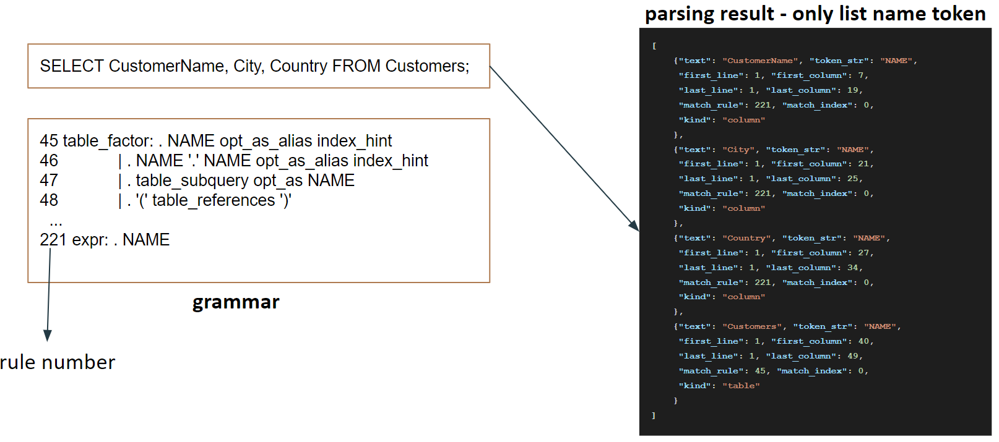

all my GSoC works are in [pull request](https://github.com/MariaDB/mariadb_kernel/pull/29/commits)(**in review**) and [one commit](https://github.com/MariaDB/server/commit/768c51880a5aa6d25d4c0fe7de7a88561ff46422)(**merged**)

This project's autocompletion is based on popular python packages - mycli. And do some enhancement, bug fix, and extend its functionality.

## the presentation video
[](https://www.youtube.com/watch?v=2g67aC0Tqfk "Everything Is AWESOME")

[the presentation's google slides' link](https://docs.google.com/presentation/d/1haQVxONRbaqs4BmnFUyhji9VCy-Ndo8ECv6tFk5wz1E/edit#slide=id.p)

## The design of this project


**There are four components**. 
`SQLAnalyze` is responsible for analyzing the SQL statement and providing a function that inputs the SQL statement and text cursor's position, then gets the suggestion.

`SQLFetch` is responsible for providing convenient function fetching data. Such as provide a `databases` function that would return a list of database names that are current DB's databases.

`Autocompleter` is responsible for simplifying the use of `SQLAnalyze` and `SQLFetch`. It would provide two functions. One is a refresh that can refresh the DB's info. The refresh way can decide to be sync or async, and another is get_suggestions. It would get suggestions based on text and cursor position.

The `introspector` is responsible for providing a `inspect` function that can given text and cursor position return the HTML that would be shown to users.

**The relationship of these four components**

`Autocompleter` uses `SQLFetch` to update the data inside `SQLAnalyze`. Such as update dbmetadata. So in `SQLAnalyze`, when need to suggest tables in the currently selected database. It can find in dbmetadata. 

`Introspector` uses `autocompleter` because it needs to shares the data that `autocompleter's SQLAnalyze` has.  And use `autocompleter’s SQLFetch` to get some HTML(such as when inspecting table word, need to get the table's schema HTML for showing to the user)


## the list of my work(not list trivial commits)

### integrate mycli with mariadb_kernel
implement three main classes - 「SQLFetch, SQLAnalyze, Autocompleter」 describe in [this comment](https://github.com/MariaDB/mariadb_kernel/pull/29#issuecomment-872046209)
#### related commits
1. [implement SQLFetch class](https://github.com/MariaDB/mariadb_kernel/pull/29/commits/f41c29ee5f3625e98c8b5fa382cca18d1def2eee)
2. [Implement AutoCompleter and SQLAnalyze](https://github.com/MariaDB/mariadb_kernel/pull/29/commits/1e7e06f3fe368aea2019c02ceb25dbd3dbf24bad)
3. [Successfully create basic autocomplete feature on mariadb_kernel](https://github.com/MariaDB/mariadb_kernel/pull/29/commits/a237724b921652a4a2321a6d123afff438946e1b)
4. [fix not select any database error in SQLFetch](https://github.com/MariaDB/mariadb_kernel/pull/29/commits/9884b711828042269054fb3ba7d1e0d20f331c23)
5. [Refactor for SQL command position and SQLFetch.Refresher's arguments passing](https://github.com/MariaDB/mariadb_kernel/pull/29/commits/1dac33b7169956eea8ee494eff9cc419c69e63b8)
6. [let autocompletion can show the type of completion in the list](https://github.com/MariaDB/mariadb_kernel/pull/29/commits/9141aee44cec373048f491e0dfe6975d5d9550fd)
   
   https://user-images.githubusercontent.com/33860799/129854594-c5d235eb-d694-4b0c-8222-a85dce0b13a7.mp4
7. asyc refresh autocompleter's data
    1. [create basic async refresh by thread
](https://github.com/MariaDB/mariadb_kernel/pull/29/commits/178fc979a670e28e8171e33df9c00e6deca8b5a2)
    2. [Merge branch 'async_refresh' into integrated_with_mycli](https://github.com/MariaDB/mariadb_kernel/pull/29/commits/05f62b39140fb5de6d150c407d7d69615d38c703)

#### enhancement of mycli
1. can set the keyword and function list and would automatically fetch the lastest keyword and function list from new information_schema tables that work in my GSoC([link](https://github.com/MariaDB/server/commit/768c51880a5aa6d25d4c0fe7de7a88561ff46422))

    [commit](https://github.com/MariaDB/mariadb_kernel/pull/29/commits/9a01a4ec0ff7ae5dc0271b7342c16700bfccf1a1)
2. Database suggestion before 「.」. Ex: 「insert into db_name_to_be_completed.table_name VALUES (...) 」
    
    commit
    1. [Database suggestion before .table_name
](https://github.com/MariaDB/mariadb_kernel/pull/29/commits/8b04cf6f96b87239bf435a899287fa898d9a983a)
    2. [Enhancement of database suggestion before 「.」
](https://github.com/MariaDB/mariadb_kernel/pull/29/commits/f673cdcdee885bac4bcc0e27881bc4ab6e6b0ef6)
   
   https://user-images.githubusercontent.com/33860799/129856199-be2a40fc-5d51-4539-937a-5ccb4f1c52e8.mp4
3. add global and session variable suggestions
    
    commit
    1. [add global and session variable suggestion on completion_engine and update sql_fetch for them](https://github.com/MariaDB/mariadb_kernel/pull/29/commits/ce111a05a744772d7cd3e6a9e42acc6c9870cb2c)
    2. [Add global and session variable suggestions and fix some problem](https://github.com/MariaDB/mariadb_kernel/pull/29/commits/1984d90b1247b0eb325f76dfc5a3f7e93ca71eae)

   https://user-images.githubusercontent.com/33860799/129861325-a1f04cf6-c8ee-43b4-96b5-b836123bb0b2.mp4
4. enhancement of database suggestions
    
    commit
    1. [Add column suggest for system table like mysql.user. And fix the problem like 「select user, `<tab>` from mysql.user;」 would get a user list](https://github.com/MariaDB/mariadb_kernel/pull/29/commits/4430709f81d77a0ea6427e9bbd03fd40807415d7)
    2. [Autocompletion about database_name.table_name_to_be_completed could suggest the table not in currently seleted database](https://github.com/MariaDB/mariadb_kernel/pull/29/commits/2831635f7db6ee6b19bd4f9edde6f917a9e7aa38)
    3. [Autocompletion for database in select, insert into, ... , like statement
](https://github.com/MariaDB/mariadb_kernel/pull/29/commits/58ba70d856eef31d18492d7deb3919cebd0d384f)

   https://user-images.githubusercontent.com/33860799/129866591-051b761b-5ba8-4da2-9d7e-073671c5218d.mp4
   
   https://user-images.githubusercontent.com/33860799/129867223-6e2bcd07-3dfd-4175-bb88-ca3d9a3b4b26.mp4
5. fix some bugs related to the name `user` is the column name and keyword
    
    commit:
    1. [Autocompletion for keyword after user column name](https://github.com/MariaDB/mariadb_kernel/pull/29/commits/9c9a8e6fd718c6cfd323ad0ddec1ec550f28cf44)

   https://user-images.githubusercontent.com/33860799/129868779-644d2294-312d-45da-ae76-f7177e27fac5.mp4
6. Remove autocompletion suggest column name from a statement like 「insert into table_name values (<tab> 」
    
   commit:
    1. [Remove autocompletion suggest column name from statement like 「insert into table_name values (<tab> 」](https://github.com/MariaDB/mariadb_kernel/pull/29/commits/baaad7cb10532ab80a167a4f15b662557141d36f)
    2. [fix the bug for 【Remove autocompletion suggest column name from statement like 「insert into table_name values (<tab> 」】](https://github.com/MariaDB/mariadb_kernel/pull/29/commits/635a90e0df613ebca0e0045889a4701d94df4f77)
   
   https://user-images.githubusercontent.com/33860799/129869785-ff397de0-c87d-43e7-bc9f-466a1fb6d388.mp4
#### extend of autocomplete feature - introspection
According to a different type of word show different info. like below table:
type | show Infos
-- | --
database | show the tables in this database
table        | show its schema, and partial table rows
column    | show the data type it stores, and some data in this column
function  | show its documentation(has syntax, description, example sections)
user         |  show user list.   


1. [Complete basic introspection functionality](https://github.com/MariaDB/mariadb_kernel/pull/29/commits/dc288c7706fdc35de968c8fce7d94d5092de3e3f)
2. [Let introspection show some real data](https://github.com/MariaDB/mariadb_kernel/pull/29/commits/b0215f8ef5bde1503739d90cfa7114507e9bb72f)

   https://user-images.githubusercontent.com/33860799/129879512-3e193b9f-a5ad-4dd2-9ddd-48446c85257a.mp4
3. [Change setup.py to include data folder and create a new feature about introspection provide column hint](https://github.com/MariaDB/mariadb_kernel/pull/29/commits/febd264e8a0e841aa850b5b84a22a9aea491c67d)
4. [feature about introspection provide column hint can handle multi values](https://github.com/MariaDB/mariadb_kernel/pull/29/commits/6bbbc123eb8ccef941411189c96a5afb8df87e45#diff-ba5fa5711361ceaf463bbfa8cf4a50b081727b471364ca32c88e8ac35b06c439R102)
   
   https://user-images.githubusercontent.com/33860799/130049893-64b3d5ef-3e23-473d-8b75-13e82846b2c1.mp4
5. [introspect function would provide documentation
](https://github.com/MariaDB/mariadb_kernel/pull/29/commits/c3dc53100c518b9bd70792163c87a2fbadf98ba7)
   
   https://user-images.githubusercontent.com/33860799/130050023-29f73651-b269-4ed1-b58b-2541cff1be09.mp4
6. [introsptect user keyword would pop up user list
](https://github.com/MariaDB/mariadb_kernel/pull/29/commits/5f92f1824908cbba011c39dbf3ec7601f8d82df5)
7. [Merge branch use_mycli_for_introspection('febd264e8a0e841aa850b5b84a22a9aea491c67d') into integrated_with_mycli](https://github.com/MariaDB/mariadb_kernel/pull/29/commits/ddd84aea11645f8d2996d64758d333deb72ccd6e)
8. [Solve some introspection problems about the different type of words have the same name](https://github.com/MariaDB/mariadb_kernel/pull/29/commits/811c6dc1824b0e2c28e8399907801409c8a77e0e)

#### related to mariadb_kernel
1. [fix mariadb_client's run_statement courrent problem](https://github.com/MariaDB/mariadb_kernel/pull/29/commits/8abef4f116d0b3c0e899a4141b86312b2d69f2a7)
2. [Add more testing about mariadb_client concurrent execute run_statement and the multi mariadb_client's selected database sync](https://github.com/MariaDB/mariadb_kernel/pull/29/commits/3523bcdcb2a2697b986e0f3e09e7cc84f2ee7e09)


## The difficulty of this project
This project encounters some tricky problems. In this section, I would discuss them.

First, use the mycli's way to implement introspection is difficult in some situations. Such as column name is same as keyword name. This result in introspection is difficult on mycli way to resolve word to the specific type.

The reason needs to describe the internal of mycli to implement autocompletion.
mycli parsing base on the python package - sqlparse. And sqlparse have some limitation. Such as, it can't resolve the name into the database, table, column, and so on. 

ex:
```python
from sqlparse import parse
result = parse("select min(col1), col2 from tabl1;")
result[0]._pprint_tree()
```
the code above would get parse tree be printed at below
   

   
`sqlparse` can recognize DML like known this statement is a select statement. And Keyword, Punctuation, Identifier, Identifier List, Function, and so on.
But it can’t resolve database, column, table, and so on. These would all be Name. Look at the place I mark green color, the token `min` should be function; The token `col1` should be column; The token `col2` should be column; The token `tabl1` should be table

And the mycli look at the parse tree, resolve Name to more specific type, such as database, table, column.
For example: 
There are a statement.
> select min(**col1**), col2 from tabl1;

we need suggest type after min(
the token before the cursor is left parenthesis
So we need to consider five cases list below:
1. In Where statement
`=>` look at more cases~
2. After Using - tbl1 INNER JOIN tbl2 USING (col1, col2)
`=>` Suggest columns/functions
3. Subquery expression like "select … from (“
`=>` Suggest keyword
4. show statement like “show “
`=>` Suggest the list of special 
5. keyword appear after show
function call like “select min(“
`=>` Suggest column

these five case is under the condition is top level’s `last token before the text cursor` is punctuation - left parenthesis. And have their own conditions.
**First**, check the top level’s last token is where instance, then look at more cases. Here not discuss that.
**Second**, check the top level’s `second last token before the text cursor`, check it is `using word` or not. If it is, suggest column
**Third**, check the top level’s first token is select, and the `last token before the text cursor` is start with left parenthesis. If it is, suggest keyword. But in this example, last word would be min(, so it is not belong this case.
**Fourth**, check the top level’s first token is show word, if it is, suggest a list of special keyword appear after show
**Fifiveth**, is not above cases, it would be in simple function call, so suggest column

In conclusion, mycli suggestion is multi options in most scenarios. But introspection needs to resolve to the specific type. There is a way to solve this problem. It is looking at the databases’ info.
For example:
for sql statement
> select **column1** from table1;

and complter.dbmetadata
```text
{'tables': {'db1': {
                     “table1”: [“*”, “column1”]            
                }
  }, 
 'views': {'db1': {}}, 
 'functions': {'db1': {}}}
```

> check priority : column_hint -> column -> table -> database -> function -> keyword

the suggestion in **column1** would be column, function or keyword or alias.
we have special resolve order. So first we check it is column or not. We look at dbmetadata’s tables field. Find in current database db1 have table named table1 or not. If exists, then check in that table has column1 or not. In this example. There exists column1. So this word is column. The introspector would get this(point to introspector.get_introspection)
And it not found, would check the next suggestion type in the priority - function type.
final the **introspector.get_introspection return :**
```text
{'word': 'column1', 'type': 'column',   
 'database': 'db1', 'table': 'table1'}
```
But there exists a problem if there exists the same name be multiple types. It may resolve to the wrong type.

For example :
for sql statement:
```sql
select min(column1) from table1;
```
if table1 has a column named min, and there exists a function named min
the word 「min 」 would be recognized as a column in the check priority

So I need to do more check on that. In this case would check the next token after cursor is left parenthesis or not. If it is left parenthesis, it would be function.

And the check priority is also important.
For example:
there are two priority:
> check priority 1: column_hint -> column -> table -> database -> function -> keyword

> check priority 2: keyword -> function -> database -> table -> column -> column_hint

if the check priority is the `check priority 1`. Then user word would be resolved to keyword. Because there has a user column in mysql.user and has user keyword. According `check priority 2`.  Function has higher priority than column.
And in the right check priority, it can solve most of wrong cases. Because mycli the most suggestion redundant types is fucntion and keyword, so their priority is lowest.

## Two type of completion engine discussion
Now I would talk about the comparison of two types of autocompletion engines.
There are two type of completion engine
1. use parser like sqlparse, which is hand-writing parser
2. use bison like parser, which is auto-generated by grammar
One is to use the hand-writing parser,if this kind of parser if maintained by the compiler or interpreter team, then it is fine to use it to implement the tool about autocompletion, go to definition, and so on. But if use the parser like sqlparse, which is not maintained by original team. The real-world parser is very complex. So sqlparse has many defects. Such as this does not match the real-world database grammar and it commonly parses the wrong result. Like the cases I show here.
sqlprase mistake 【t1 (a, b, c)】 「table name and column list」 as function. This is a big problem. For exmaple:
> insert into **t1 (a, b, c)** VALUES (1 ,2 ,3);


And for the second, if the grammar feed into bison is complete and no ambiguity, then the parse result would not be wrong. Can make sure it cover the whole grammar and nearly no error. And the mariadb is maintained the 「sql/sql_yacc.yy」, it can be used and can has the same parser with the mariadb sql database. And we can easily annotated something into parsing process and get the information that help a lot in autocompletion.

## my autocompletion engine

there are three main component lexer_caller, bison_xml_reader and autocompletion_engine.
Because our project is using python but bison generated parser and lexer is written in C. So I need to build a .so file for lexer and create a lexer_caller to load the library file and execute it get a list of tokens.

And I would need to annotated info at parsing process. So I create a bison_xml_reader read the xml report get the LR1 parsing need info like goto_table and action_table. So I can parse on them.


If we parse the statement at the left, then we will get the result at the right.
And in this example, I only show the name token.
So I can base on the token matched rule number and matched index to deduce it should be database, table or function, and so on.
Such as the word Customers. It match on rule 45 - table_factor. And in this rule first token should be table, so the word Customers is table name.


And the autocompletion is not only parsed the complete SQL statement. It needs to predicate the next word is what. With the info in the bison report, it would be easy. According to the current state's transitions info. We can know the next word is what kind of token. In this case, the next token can be NAME, STRING, INTNUM, BOOL, APPROXNUM, USERVAR, NOT, ... etc. And it can reduce the matched symbols to select_expr_list, select_expr, expr. And the NAME token needs to digging more details types like database, column, table, and so on. So we look at the NAME token's transition. It would be from state 25 to state 51. And in State 51 has three rules that consume the NAME token. Rule 221's NAME token consumed is a column; rule 223's NAME token consumed is a table. Rule 264's NAME token consumed is function. So it not only suggests keywords and functions like STRING, INTNUM, BOOL, ... etc but also suggests a column, table, and function.
But this autocompletion engine is still in early stage. So it is not adopted in this project
